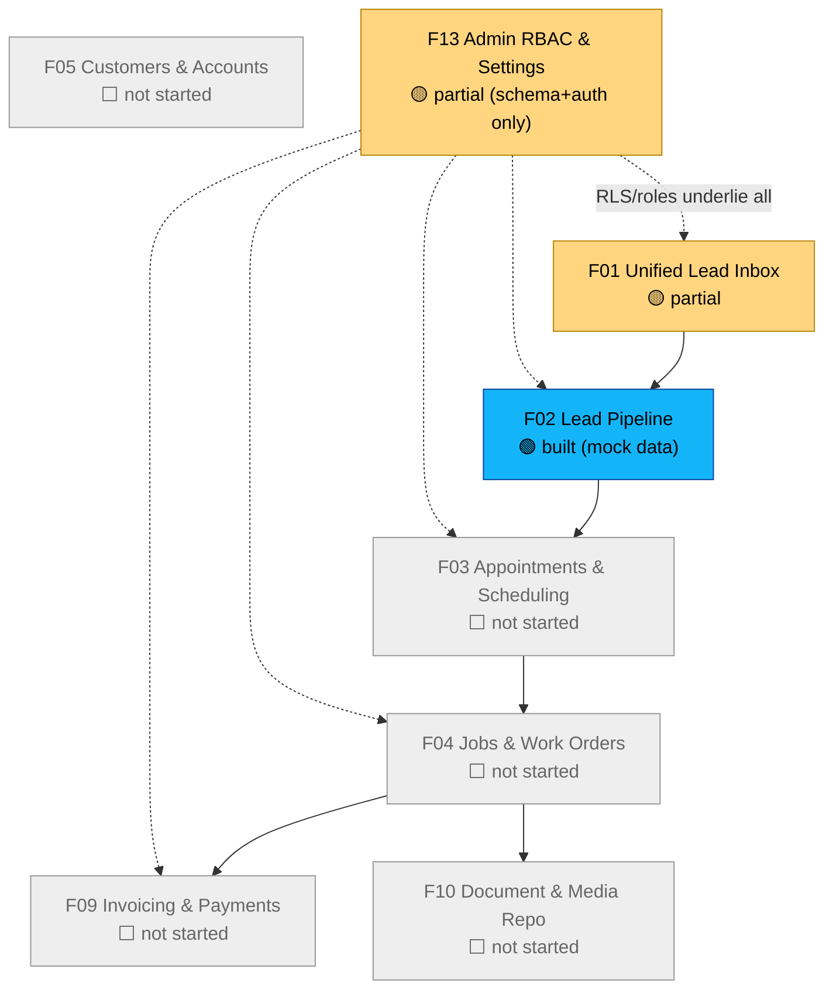
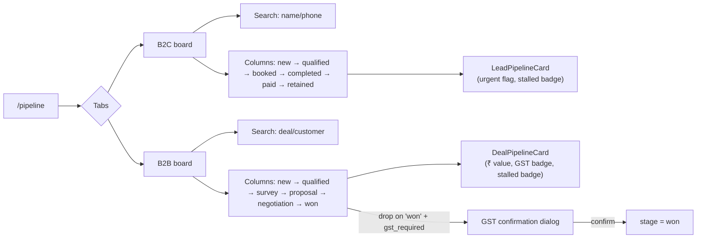

# Build Status (live)

Snapshot of what's actually built in `breezyops/` vs. the [[Feature-Index|13-feature spec]]. Update this after every feature lands — this is the "state of the world" for the code, same role [[Project-Context]] plays for the business. See [[Build-Log]] for the change-by-change history and reasoning.

**Last updated:** 2026-07-13, after F02.

## Phase 1 progress

## What's real vs. mock right now

| Layer | State |
|---|---|
| Auth (login) | 🟢 Real — Supabase email/phone OTP, two-stage send→verify, working end to end |
| Database | 🔴 Not connected — no `DATABASE_URL`; app falls back to mock data everywhere. See [[Gaps-and-Open-Questions]] #4 |
| RLS policies | 🟡 Written (`supabase/policies.sql`), covers all tables incl. `deals`, never applied to a live project yet |
| Lead webhook intake | 🟡 Code complete, untested against a real DB |
| Leads inbox UI (F01) | 🟢 Built, mock data, actions are stubs (toast only, no real qualify/book/lose) |
| Pipeline boards (F02) | 🟢 Built, mock data, drag-and-drop persists only in local state |
| Dashboard KPIs | 🔴 Hardcoded sample numbers, not wired to any query |

## Feature IA — F02 Lead Pipeline (built this session)

## Known gaps to close before "Phase 1 exit criteria"
Per [[Build-Phases]], exit criteria is *10 real jobs run fully through Breezyops*. Still required:
1. Real Supabase project wired (`DATABASE_URL` + service role key), schema pushed, RLS applied
2. F03 Appointments, F04 Jobs/Work Orders, F05 Customers, F09 Invoicing, F10 Document Repo built
3. F13 admin setup wizard + service catalog + audit log UI
4. Pipeline/inbox actions wired to real mutations (currently toast-only stubs)
5. Regression pass + UX audit once the above land — not meaningful to run against mock-only screens
