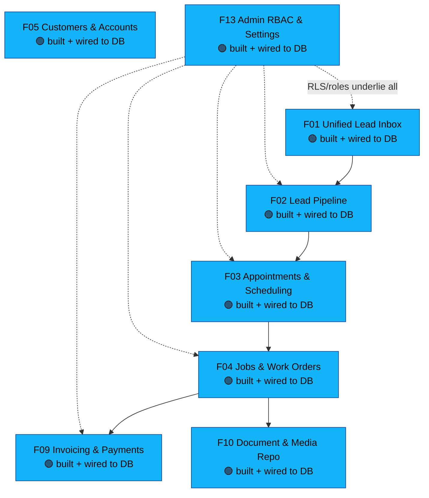
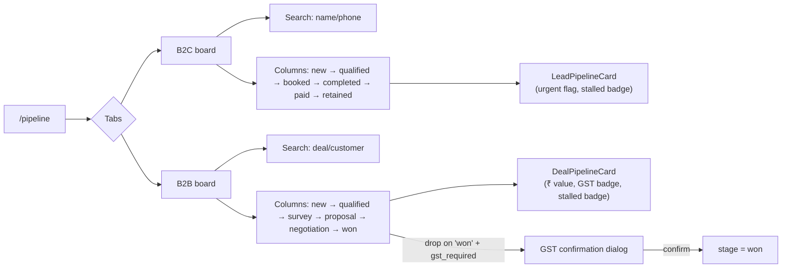
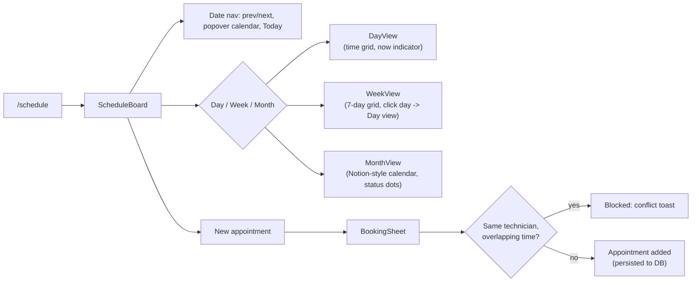

# Build Status (live)

Snapshot of what's actually built in `breezyops/` vs. the [[Feature-Index|13-feature spec]]. Update this after every feature lands — this is the "state of the world" for the code, same role [[Project-Context]] plays for the business. See [[Build-Log]] for the change-by-change history and reasoning.

**Last updated:** 2026-07-16 (v0.11 — appointment detail sheet, vertical button stacking across all modals, appointment status actions. Vercel staging deployment in progress.)

## Phase 1 progress

## What's live right now

| Layer | State |
|---|---|
| Auth (login) | 🟢 Real — Supabase email/phone OTP, two-stage send→verify, working end to end |
| Database | 🟢 Connected — Supabase JS client over HTTPS (direct PG blocked by IPv6). All data queries use real DB. |
| Schema | 🟢 Pushed — 14 tables, 10 enums, all indexes created via Supabase SQL Editor (12-step migration) |
| RLS policies | 🟢 Applied — 20 RBAC policies on all 13 tables, helper functions, auto-profile trigger, catalog_public view |
| Lead webhook intake | 🟢 Code complete, using Supabase JS client, timing-safe secret, error handling |
| Leads inbox UI (F01) | 🟢 Built, real DB data, mutations wired to server actions with revalidation |
| Pipeline boards (F02) | 🟢 Built, real DB data, drag-and-drop persists via `updateLeadStatusAction` / `updateDealStageAction` |
| Schedule (F03) | 🟢 Built, real DB data, day/week/month view, booking sheet wired to `createAppointmentAction`. Day view: Notion-style column layout with hour grid lines, overlap detection, left accent border. Click-to-open appointment detail sheet with status actions (complete, reschedule, no-show, cancel). Week view: today highlight with bg-primary/5. |
| Customers (F05) | 🟢 Built, real DB data — list (All/B2C/B2B tabs, search, revenue) + detail sheet + [id] page |
| Jobs (F04) | 🟢 Built, real DB data — list (All/Scheduled/Active/Done tabs, search) + detail sheet wired to `updateJobStatusAction` |
| Invoices (F09) | 🟢 Built, real DB data — list (All/Draft/Sent/Paid/Overdue tabs, search) + detail sheet wired to `updateInvoiceStatusAction` |
| Settings (F13) | 🟢 Built, wired to real DB — catalog (inline price/cost edit), users (profiles), localities (add/view), integrations, audit log |
| Dashboard KPIs | 🟢 Wired to real DB queries (leads, jobs, invoices, customers, appointments) |
| F10 Document & Media | 🟢 Built, real DB data — card grid with gradient thumbnails, type tabs, search, upload stub, detail sheet with preview card |
| Rate limiting | 🟢 In-memory sliding-window rate limiter on auth/confirm (10/min) and webhook (30/min) |
| Sidebar | 🟢 Shadcn sidebar component — collapsible icon mode, active nav highlighting (primary accent + left border), Caveat font brand, toggle in header, clickable logo to expand, avatar profile with initials |

## Pages

| Route | Feature | Description |
|---|---|---|
| `/` | Dashboard | Real KPIs from DB |
| `/leads` | F01 | Lead inbox — real DB data + detail sheet |
| `/pipeline` | F02 | B2C/B2B kanban boards, drag-drop |
| `/schedule` | F03 | Day/week view, booking sheet, conflict guard |
| `/customers` | F05 | List (tabs All/B2C/B2B, search, revenue) + detail sheet + [id] page |
| `/jobs` | F04 | List (tabs All/Scheduled/Active/Done, search) + detail sheet |
| `/invoices` | F09 | List (tabs All/Draft/Sent/Paid/Overdue, search) + detail sheet |
| `/settings` | F13 | Catalog table, users, localities, integrations, audit log |
| `/documents` | F10 | Document library — type tabs, search, upload stub, detail sheet |

## Components

| Directory | Files |
|---|---|
| `components/leads/` | `lead-inbox.tsx`, `lead-detail-sheet.tsx` |
| `components/pipeline/` | `kanban-board.tsx`, `b2c-board.tsx`, `b2b-board.tsx`, `lead-pipeline-card.tsx`, `deal-pipeline-card.tsx`, `deal-detail-sheet.tsx`, `lead-detail-pipeline-sheet.tsx` |
| `components/schedule/` | `schedule-board.tsx`, `day-view.tsx`, `week-view.tsx`, `month-view.tsx`, `booking-sheet.tsx` |
| `components/layout/` | `header.tsx` |
| `components/app-sidebar.tsx` | Shadcn sidebar with active highlighting, Caveat brand |
| `components/hooks/` | `use-mobile.ts` |
| `components/ui/sidebar.tsx` | Shadcn sidebar primitives |
| `components/customers/` | `customer-list.tsx`, `customer-detail-sheet.tsx` |
| `components/jobs/` | `job-list.tsx`, `job-detail-sheet.tsx` |
| `components/invoices/` | `invoice-list.tsx`, `invoice-detail-sheet.tsx` |
| `components/settings/` | `settings-panel.tsx` |
| `components/docs/` | `document-library.tsx`, `document-detail-sheet.tsx` |

## Schema (`lib/db/schema.ts`)

**Tables (14):** localities, profiles, customers, sites, leads, deals, serviceCatalog, jobs, appointments, invoices, documents, media, consents, activityLog

**Enums (10):** userRole, segment, leadChannel, leadStatus, dealStage, jobStatus, invoiceStatus, documentType, mediaCategory, appointmentStatus

## DB queries (`lib/db/queries.ts`)

All queries use Supabase JS client over HTTPS (direct PG connection blocked by IPv6 on this machine).

| Function | Returns | Notes |
|---|---|---|
| `fetchLeads()` | `LeadRow[]` | With locality name join |
| `fetchDeals()` | `DealRow[]` | With customer + locality join |
| `fetchAppointments()` | `AppointmentRow[]` | With customer, locality, technician join |
| `fetchJobs()` | `JobRow[]` | With customer, technician, site address join |
| `fetchCustomers()` | `CustomerRow[]` | Enriched with job count, revenue, sites |
| `fetchCustomerById(id)` | `CustomerRow \| null` | Full detail with jobs, invoices, sites |
| `fetchInvoices()` | `InvoiceRow[]` | With customer name join |
| `fetchDocuments()` | `DocumentRow[]` | With customer name join |
| `fetchMedia()` | `MediaRow[]` | With customer name join |
| `fetchDashboardKPIs()` | `DashboardKPIs` | All KPIs in one query batch |
| `fetchTechnicians()` | `{ id, fullName }[]` | Active profiles |
| `fetchLocalities()` | `Locality[]` | Active localities |
| `updateLeadStatus()` | `void` | With optional lost reason |
| `updateDealStage()` | `void` | |
| `createAppointment()` | `new appointment` | With conflict check |
| `updateJobStatus()` | `void` | |
| `updateInvoiceStatus()` | `void` | |
| `fetchProfiles()` | `{ id, name, role, active }[]` | Settings users tab |
| `fetchServiceCatalog()` | `{ id, name, segment, price, cost, active }[]` | Settings catalog tab |
| `fetchActivityLog()` | `{ id, actor, action, entity, time }[]` | Settings audit tab, last 20 |
| `fetchAllLocalities()` | `{ id, name, active }[]` | Settings localities (includes inactive) |
| `updateCatalogItem()` | `void` | Price/cost edit |
| `addLocality()` | `void` | New locality |

## Server Actions (`app/actions.ts`)

| Action | Revalidates | Notes |
|---|---|---|
| `updateLeadStatusAction` | /leads, /pipeline, / | With optional lost reason |
| `updateDealStageAction` | /pipeline, / | |
| `createAppointmentAction` | /schedule, / | Returns new appointment |
| `updateJobStatusAction` | /jobs, /schedule, / | |
| `updateInvoiceStatusAction` | /invoices, / | |
| `updateCatalogItemAction` | /settings | Price/cost edit |
| `addLocalityAction` | /settings | New locality |

## Mock data (`lib/db/mock.ts`)

Still exported but **no longer imported** by any component. Kept for reference/testing only.

| Export | Count |
|---|---|
| `mockLeads` | 6 |
| `mockDeals` | 4 |
| `mockCustomers` | 8 |
| `mockAppointments` | 6 |
| `mockJobs` | 7 |
| `mockInvoices` | 7 |
| `mockDocuments` | 8 |
| `mockMedia` | 6 |
| `mockTechnicians` | 4 |

## Feature IA — F02 Lead Pipeline

## Feature IA — F03 Appointments & Scheduling

## Known gaps to close before "Phase 1 exit criteria"
Per [[Build-Phases]], exit criteria is *10 real jobs run fully through Breezyops*. All infrastructure work is complete. Remaining:
1. ~~Wire client-side mutations~~ ✅ done
2. ~~RLS policies applied to live project~~ ✅ done
3. ~~Settings page wired to real DB~~ ✅ done
4. ~~Rate limiting~~ ✅ done
5. ~~Test framework~~ ✅ Vitest, 21 tests passing
6. ~~Security: open redirect fix~~ ✅ done
7. ~~Regression pass + UX audit~~ ✅ done (v0.7 — all 37 UX issues resolved)
8. ~~LOW polish sweep~~ ✅ done (v0.8 — as any casts, typing, ScrollArea, Table, ESLint)
9. ~~React 19 strict mode compliance~~ ✅ done (v0.8 — no setState-in-effect, no impure render)

| Gap | Status |
|---|---|
| Mobile nav | ✅ resolved |
| loading.tsx | ✅ resolved |
| Keyboard DnD | ✅ resolved |
| Accessibility (aria-labels, form labels) | ✅ resolved |
| Lead search | ✅ resolved |
| Responsive tables | ✅ resolved |
| SLA timer | ✅ resolved |
| Login improvements | ✅ resolved |
| Dark mode | ✅ resolved |
| as any type safety | ✅ resolved |
| ESLint + React 19 strict mode | ✅ resolved |
| Mutation error handling (try-catch) | ✅ resolved (v0.9) |
| Error boundary logging | ✅ resolved (v0.9) |
| Document thumbnail previews | ✅ resolved (v0.9) |
| Tab selected shadow highlight | ✅ resolved (v0.9) |
| Invoice preview (PDF in-dialog) | ✅ resolved (v0.9) |
| Pipeline detail sheets (click-to-open) | ✅ resolved (v0.9) |
| BREEZYAIR branding on invoices | ✅ resolved (v0.9) |
| Sheet padding consistency | ✅ resolved (v0.9) |
| Dropdown overlap in modals | ✅ resolved (v0.10) — SelectContent z-[60], position="popper" sideOffset, hover effects, bg-popover token |
| Day view overlapping appointments | ✅ resolved (v0.10) — Notion-style column layout with hour grid, overlap detection |
| Badge color inconsistency | ✅ resolved (v0.10) — scheduled→outline, cancelled→destructive, lost stage added |
| Visual hierarchy (font sizes) | ✅ resolved (v0.10) — deal values, revenue, totals → font-semibold |
| Dead header search | ✅ resolved (v0.10) — removed, Search icon added to jobs |
| New customer booking flow | ✅ resolved (v0.10) — redirect to /customers with returnTo param |
| Week view today highlight | ✅ resolved (v0.10) — bg-primary/5 + font-semibold date |
| Sidebar (shadcn) | ✅ resolved (v0.10) — collapsible icon mode, active nav highlighting, Caveat font brand |
| Layout spacing consistency | ✅ resolved (v0.10) — all pages w-full px-6 py-8, fills available space |
| Appointment detail view | ✅ resolved (v0.11) — click-to-open sheet with customer, technician, service, locality, time, notes, status actions |
| Modal button stacking | ✅ resolved (v0.11) — all sheet/dialog footers use vertical layout with w-full buttons |

**Remaining:** E2E test framework (Playwright/Cypress), notification system, command palette

## Deployment

| Layer | State |
|---|---|
| GitHub repo | 🟢 Pushed — `ameensyed397-ui/BREEZYOPS` |
| Vercel project | 🟡 Staging deployment in progress — `breezyops/breezyops` |
| Production URL | ⏳ Pending staging verification |
